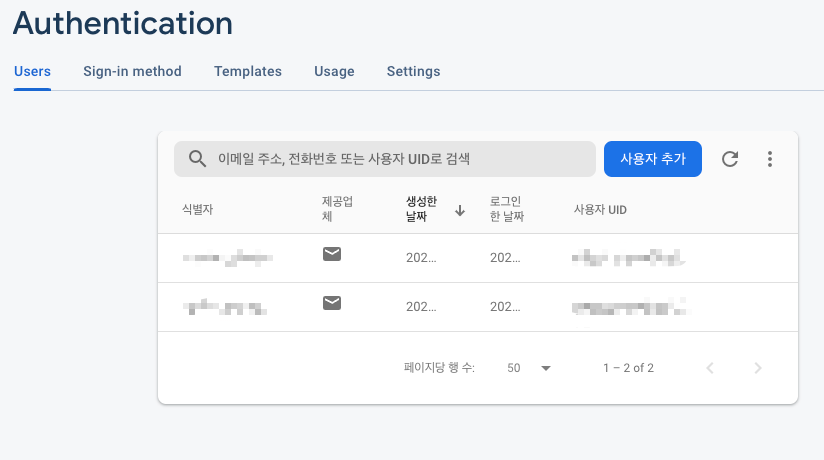
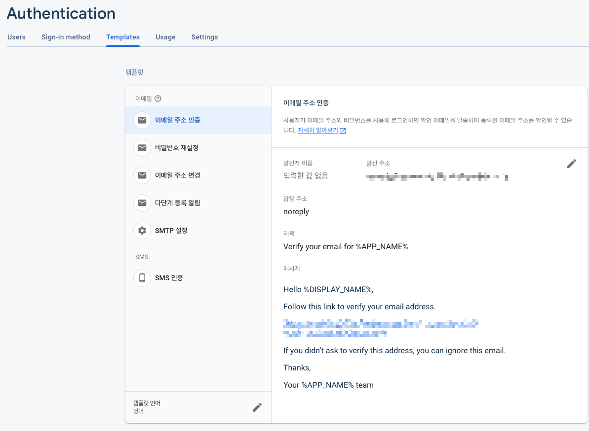
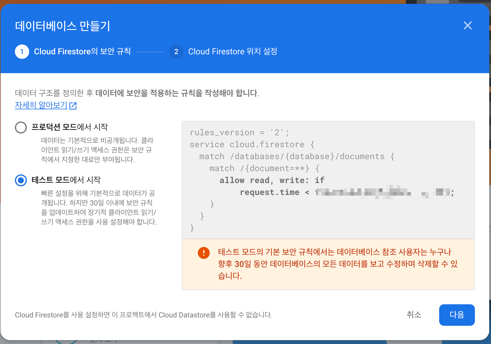
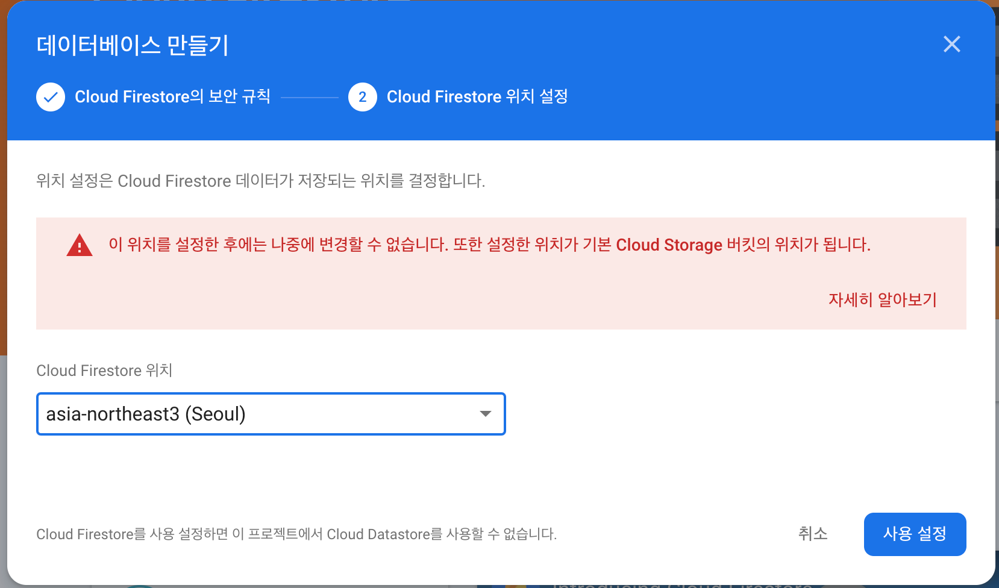
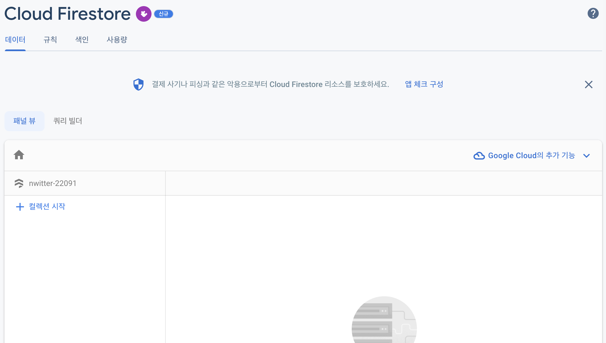
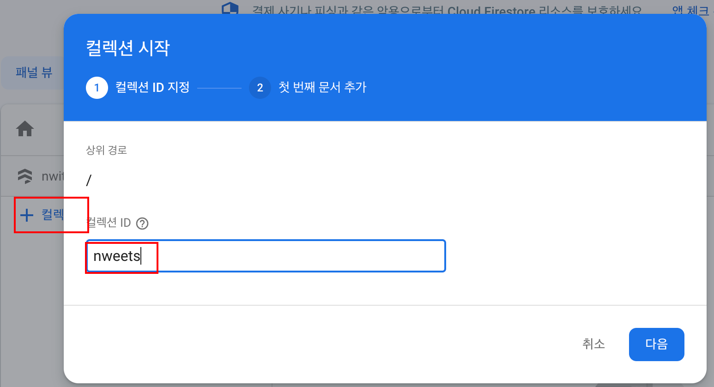
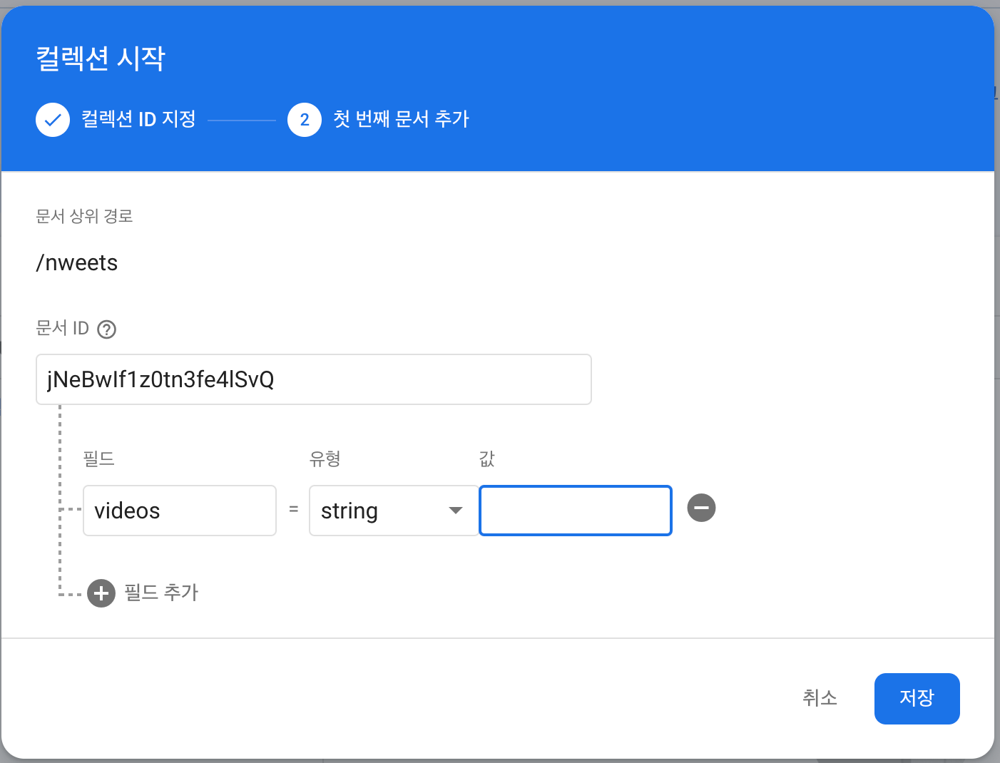
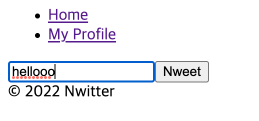
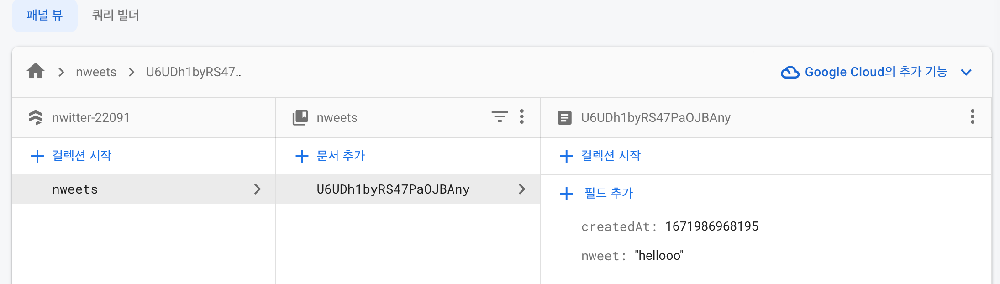
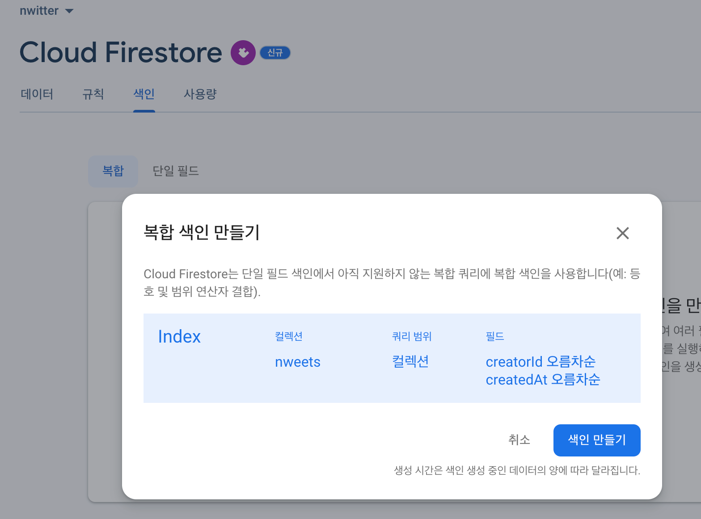

# Twitter 클론코딩 하면서 firebase 공부하기

## 세팅

1. `src` 폴더를 싹 비워준다. ( `App.js` 와 `index.js` 만 남긴다.)

```javascript
// App.js
import React from "react";

function App() {
  return <div>hello</div>;
}
export default App;
```

```javascript
// index.js
import React from "react";
import ReactDOM from "react-dom";
import App from "./App";

ReactDOM.render(
  <React.StrictMode>
    <App />
  </React.StrictMode>,
  document.getElementById("root")
);
```

2. firebase [Docs Firebase 웹](https://firebase.google.com/docs/web/setup?authuser=0&hl=ko)
   1. `npm install firebase` firebase 설치
   2. `src/firebase.js` 파일을 만들고 다음 코드를 붙여넣는다

```javascript
// src/firebase.js
import * as firebase from "firebase/app";

const firebaseConfig = {
  apiKey: "aaaaaaaaaaaaaaaaaaaaaaaaaaaaaaaaaaaaa",
  authDomain: "bbbbbbbbbbbbbbbbbbbbb",
  projectId: "ccccccccccccccc",
  storageBucket: "ccccccccccccccc.appspot.com",
  messagingSenderId: "eeeeeeeeeeeeeee",
  appId: "dddddddddddddddddddddddddddddddd",
  databaseURL: "https://ffffffffffffff.firebaseio.com",
};

export default firebase.initializeApp(firebaseConfig);
```

3. 이제 `import firebase from "src/firebase"` 코드로 firebase 를 import 하여 사용할 수 있다.

####

> `firebase` 에 대한 코드를 저런식으로 관리하는 것보다 `.env` 파일에 따로 관리하는게 보안에 더 좋다 <br> > `create-react-app` 에서 환경변수를 사용하려면 `REACT_APP_` 으로 시작해야 하고 그 뒤로 이름을 붙여줘야 한다. (예 `REACT_APP_SOMETHING`) <br>

```javascript
// .env
REACT_APP_API_KEY = aaaaaaaaaaaaaaaaaaaaaaaaaaaaaa;
REACT_APP_AUTH_DOMAIN = bbbbbbbbbbbbbbb.com;
REACT_APP_PROJECT_ID = ccccccccccccccc;
REACT_APP_STORAGE_BUCKET = ccccccccccccccc;
REACT_APP_MESSAGING_SENDER_ID = dddddddddddddd;
REACT_APP_APP_ID = eeeeeeeeeeeeeeeeeeeeee;
REACT_APP_DATABASE_URL = fffffffffffffff;
```

```javascript
// firbase.js
import * as firebase from "firebase/app";

const firebaseConfig = {
  apiKey: process.env.REACT_APP_API_KEY,
  authDomain: process.env.REACT_APP_AUTH_DOMAIN,
  projectId: process.env.REACT_APP_PROJECT_ID,
  storageBucket: process.env.REACT_APP_STORAGE_BUCKET,
  messagingSenderId: process.env.REACT_APP_MESSAGING_SENDER_ID,
  appId: process.env.REACT_APP_APP_ID,
  databaseURL: process.env.REACT_APP_DATABASE_URL,
};

export default firebase.initializeApp(firebaseConfig);
```

> 단 이 방법은 github 에 올라가는걸 막아주는 조치에 불과하다. <br>
> 결국 이 정보는 리액트가 클라이언트단에서 랜더링 되기 떄문에 보안적으로 충분하진 않다.

## Authentication

### Using Firebase Auth

> 문서 : [Docs firebase auth](https://firebase.google.com/docs/auth/?authuser=0&hl=ko) [firebase v8 firebase.auth](https://firebase.google.com/docs/reference/js/v8/firebase.auth.Auth?authuser=0)

- 유저를 가져와서 로그인 여부를 따져야 한다.
- auth 를 하려면 import 를 해야한다.

```javascript
// fbase.js
import * as firebase from "firebase/app";
import "firebase/auth";

const firebaseConfig = {
  apiKey: process.env.REACT_APP_API_KEY,
  authDomain: process.env.REACT_APP_AUTH_DOMAIN,
  projectId: process.env.REACT_APP_PROJECT_ID,
  storageBucket: process.env.REACT_APP_STORAGE_BUCKET,
  messagingSenderId: process.env.REACT_APP_MESSAGING_SENDER_ID,
  appId: process.env.REACT_APP_APP_ID,
  databaseURL: process.env.REACT_APP_DATABASE_URL,
};

firebase.initializeApp(firebaseConfig);

export const authService = firebase.auth();
r;
```

> 라우터에도 프롭을 전달할 수 있다.

```javascript
// src/components/App.js
import React, { useState } from "react";
import AppRouter from "components/Router";
import { authService } from "fbase";

function App() {
  const [isLoggedIn, setIsLoggedIn] = useState(authService.currentUser);
  return (
    <>
      <AppRouter isLoggedIn={isLoggedIn} /> // 라우터에 isLoggedIn 전달
      <footer>&copy; {new Date().getFullYear()} Nwitter</footer>
    </>
  );
}

export default App;
```

- 어플리케이션이 실행되면, firebase 는 로그인 했는지 확인할 수가 없다. (너무 빨리 실행되서 firebase를 기다리지 못함) 그래서 어플리케이션이 실행되면 항상 로그아웃 되고 currentUser 가 없게(null)된다.
- 시간이 지나야 currentUser state가 업데이트 된다

> jsconfig.json 에서 기본경로를 지정해줄 수 있다

```json
// jsonconfig.json
{
  "compilerOptions": {
    "baseUrl": "src"
  },
  "include": ["src"]
}
```

- 이렇게 하면 components 폴더에서 "../fbase" 처럼 안쓰고 그냥 "fbase" 만 적어도 "src/fbase" 로 인식 시킬 수 있다.
- 상대경로 표기가 가독성이 떨어지는 경우 유용하다

#### authentication

1. `fbase.js` 에서 `const authService = firebase.auth()` 를 내보내준다.
2. `App.js` 에서 `authService` 를 `import` 한다
3. `authService.currentUser`를 가져와서 현재 유저가 로그인 했는지 여부를 알 수 있다.

```javascript
import * as firebase from "firebase/app";
import "firebase/auth";

firebase.initializeApp(firebaseConfig);

export const authService = firebase.auth();
```

```javascript
// components/App.js
import React, { useState } from "react";
import AppRouter from "components/Router";
import { authService } from "fbase";

function App() {
  const [isLoggedIn, setIsLoggedIn] = useState(authService.currentUser);
  return (
    <>
      <AppRouter isLoggedIn={isLoggedIn} />
      <footer>&copy; {new Date().getFullYear()} Nwitter</footer>
    </>
  );
}

export default App;
```

### Login Form

1. firebase 콘솔 > 빌드 > authentication 섹션으로 이동
2. 시작하기
3. 원하는 로그인 방식(Sign-in method)을 선택한다 (예시-이메일/비밀번호,구글, 깃허브 등)

#### 깃허브 로그인 할 경우 셋업을 해줘야 한다.

1. firebase 에서 `깃허브를 로그인 방식으로 등록`한 뒤에 주는 승인 콜백 URL 을 복사해놓는다.
2. `https://github.com/settings/apps` 로 접속
3. `OAuth Apps` 네비버튼 클릭
4. `Register new application` 버튼 클릭
5. `콜백 url` 을 비롯한 내용들을 적고 생성해준다.
6. `Client ID` 와 `Client Secret` 을 주는데 해당 내용을 다시 firebase `클라이언트 ID` 와 `클라이언트 보안 비밀번호`에 입력한다.

#### Auth.js 를 완성해준다.

```javascript
// src/routes/Auth.js
const Auth = () => {
  const [email, setEmail] = useState("");
  const [password, setPassword] = useState("");
  const onChange = (event) => {
    const {
      target: { name, value },
    } = event;
    if (name === "email") {
      setEmail(value);
    } else if (name === "password") {
      setPassword(value);
    }
  };
  const onSubmit = (event) => {
    event.preventDefault();
  };
  return (
    <div>
      <form onSubmit={onSubmit}>
        <input
          name='email'
          type='text'
          placeholder='Email'
          required
          value={email}
          onChange={onChange}
        />
        <input
          name='password'
          type='password'
          placeholder='Password'
          required
          value={password}
          onChange={onChange}
        />
        <input type='submit' value='Log In' />
      </form>
      <div>
        <button>Continue with Google</button>
        <button>Continue with Github</button>
      </div>
    </div>
  );
};
export default Auth;
```

### Creating account

> [firebase.auth - EmailAuthProvider](https://firebase.google.com/docs/reference/js/v8/firebase.auth.EmailAuthProvider?authuser=0)

- `EmailAuthProvider` 의 용도

1. `firebase.auth.Auth.createUserWithEmailAndPassword`이메일과 패스워드로 계정을 생성
   - 사용자 계정을 성공적으로 만들면, 자동으로 사용자는 어플리케이션에 로그인도 된다.
   - 계정을 만들 때 이미 계정이 있거나 해당 패스워드를 사용할 수 없으면 실패한다
2. `firebase.auth.Auth.signInWithEmailAndPassword` 이메일과 패스워드로 로그인

#### 계정생성 코드

- newAccount state 를 이용하여 같은 컴포넌트를 로그인창과 회원가입창 두가지용도로 사용한다
- 비동기로 `authService.createUserWithEmailAndPassword(email, password)` 코드를 작성한다.

```javascript
// src/routes/Auth.js
import { authService } from "fbase";

const Auth = () => {
  const [newAccount, setNewAccount] = useState(true); // signup 인지 login 인지

  const onSubmit = async (event) => {
    event.preventDefault();
    try {
      let data;
      if (newAccount) {
        data = await authService.createUserWithEmailAndPassword(
          email,
          password
        );
      } else {
        data = await authService.signInWithEmailAndPassword(email, password);
      }
      console.log(data);
      //
    } catch (error) {
      console.log(error);
    }
  };
  return (
    // 회원가입 form , inputs 등
    <input type='submit' value={newAccount ? "Create Account" : "Log In"} />
  );
};
```

```javascript
// 성공적으로 계정생성시, console.log(data) 로 찍히는 오브젝트의 모습
{
    "user": {
        "uid": "asdfa7sdf7878adf78asd7f8",
        "displayName": null,
        "photoURL": null,
        "email": "abcd@hanmail.net",
        "emailVerified": false,
        "phoneNumber": null,
        "isAnonymous": false,
        "tenantId": null,
        "providerData": [
            {
                "uid": "abcd@hanmail.net",
                "displayName": null,
                "photoURL": null,
                "email": "abcd@hanmail.net",
                "phoneNumber": null,
                "providerId": "password"
            }
        ],
        "apiKey": "adsfasdf1239aidf9aisdf912afnadf",
        "appName": "[DEFAULT]",
        "authDomain": "nwitter-123.firebaseapp.com",
        "stsTokenManager": {
            "apiKey": "123a0dfa0sdfasdfasif9i19",
            "refreshToken": "adfasdfiasdf9ias9dfia9sfasdfa",
            "accessToken": "asdfjaisdf123123kj12k3j123jiji123i123",
            "expirationTime": 1671975196000
        },
        "redirectEventId": null,
        "lastLoginAt": "1671971596790",
        "createdAt": "1671971596790",
        "multiFactor": {
            "enrolledFactors": []
        }
    },
    "credential": null,
    "additionalUserInfo": {
        "providerId": "password",
        "isNewUser": true
    },
    "operationType": "signIn"
}
```

- firebase 의 Authentication - Users 에 보면 계정이 생긴 것을 확인할 수 있다.
  

#### setPersistence [문서](https://firebase.google.com/docs/reference/js/v8/firebase.auth.Auth?authuser=0#setpersistence)

> setPersistence ( persistence : Persistence ) : Promise < void >

- user들을 어떤식으로 기억할지 결정한다.
- `default: local`

| Enum                                   | Value     | Description                                                                 |
| -------------------------------------- | --------- | --------------------------------------------------------------------------- |
| firebase.auth.Auth.Persistence.Local   | 'local'   | 브라우저를 닫아도 사용자 정보가 기억됨                                      |
| firebase.auth.Auth.Persistence.SESSION | 'session' | 탭이 열려있는 동안에만 사용자 정보를 기억함                                 |
| firebase.auth.Auth.Persistence.NONE    | 'none'    | 유저를 기억하지 않음(일단 로그인은 시켜줘도 새로고침하면 다시 로그인해야함) |

```javascript
// 예시
firebase
  .auth()
  .setPersistence(firebase.auth.Auth.Persistence.SESSION)
  .then(function () {
    // Existing and future Auth states are now persisted in the current
    // session only. Closing the window would clear any existing state even if
    // a user forgets to sign out.
  });
```

### Log In (로그인시)

```javascript
// src/components/App.js
import React, { useState } from "react";
import AppRouter from "components/Router";
import { authService } from "fbase";

function App() {
  const [isLoggedIn, setIsLoggedIn] = useState(authService.currentUser);
  return (
    <>
      <AppRouter isLoggedIn={isLoggedIn} />
    </>
  );
}

export default App;
```

- 어플리케이션이 실행되면, firebase 는 로그인 했는지 확인할 수가 없다. (너무 빨리 실행되서 firebase를 기다리지 못함) 그래서 어플리케이션이 실행되면 항상 로그아웃 되고 currentUser 가 없게(null)된다.
- 시간이 지나야 currentUser state가 업데이트 된다

#### [onAuthStateChanged](https://firebase.google.com/docs/reference/js/v8/firebase.auth.Auth?authuser=0#onauthstatechanged) : 사용자의 로그인 상태 변화의 관찰자

> Auth > onAuthStateChanged <br>
> onAuthStateChanged ( nextOrObserver : Observer < any > | ( ( a : User | null ) => any ) , error ? : ( a : Error ) => any , completed ? : firebase.Unsubscribe ) : firebase.Unsubscribe <br>
> onAuthStateChanged(콜백함수, 에러시콜백함수?, 완료시콜백함수?)

```javascript
// 사용방법
firebase.auth().onAuthStateChanged(function (user) {
  if (user) {
    // User is signed in.
  }
});
```

- 로그인하거나, 로그아웃, 계정 생성 등 여러 상태가 될 때마다 값이 변하므로 useEffect 와 함께 사용한다.

> 수정

```javascript
// src/components/App.js
function App() {
  const [init, setInit] = useState(false);
  const [isLoggedIn, setIsLoggedIn] = useState(false);
  useEffect(() => {
    authService.onAuthStateChanged((user) => {
      // onAuthStateChanged
      if (user) {
        setIsLoggedIn(true);
      } else {
        setIsLoggedIn(false);
      }
      setInit(true);
    });
  }, []);
  return (
    <>{init ? <AppRouter isLoggedIn={isLoggedIn} /> : "Initializing..."}</>
  );
}

export default App;
```

- `useEffect` 에 의해 컴포넌트가 마운트 되면, `onAuthStateChnaged` 메소드가 작동한다.
- `onAuthStateChanged` 는 이제 유저의 상태를 관찰하는데, `user` 가 있으면 로그인 상태를 `true` 로 만들고, 아니면 `false` 로 한다.(변화를 listening 하는 것)
- `init` 이 `false` 이면 `<AppRouter />` 를 숨긴다. (로딩을 관리하는 state라고 보면됨)
- 이 과정을 통해 firebase 를 기다렸다가 로그인 상태를 반영한다.

> ### 강제 로그아웃 하기 <br>
>
> 개발자도구 > Application > IndexedDB > firebaseLocalStorageDb 의 fbase_key 삭제

## Social Login

### [signInWithPopup](https://firebase.google.com/docs/reference/js/v8/firebase.auth.Auth?authuser=0&hl=ko#signinwithpopup) 메소드, [signInWithRedirect](https://firebase.google.com/docs/reference/js/v8/firebase.auth.Auth?authuser=0&hl=ko#signinwithredirect) 메소드

> [signInWithPopup](https://firebase.google.com/docs/reference/js/v8/firebase.auth.Auth?authuser=0&hl=ko#signinwithpopup)<br>
> signInWithPopup ( provider : AuthProvider ) : Promise < UserCredential ><br>
> 팝업베이스의 OAuth 인증 플로우를 제공한다. <br>
> 성공시 로그인을 리턴, 실패시 에러에 관한 오브젝트를 리턴

#### 사용방법

1. 프로바이더를 만든다
2. 프로바이더로 로그인한다.

```javascript
// 사용예시

// provider 객체 생성
let provider = new firebase.auth.FacebookAuthProvider();
// provider 에 다른 스코프도 추가할 수 있다:
provider.addScope("email");
provider.addScope("user_friends");
// 팝업베이스 로그인 :
auth.signInWithPopup(provider).then(
  function (result) {
    // The firebase.User instance:
    let user = result.user;
    // The Facebook firebase.auth.AuthCredential containing the Facebook
    // access token:
    let credential = result.credential;
  },
  function (error) {
    // The provider's account email, can be used in case of
    // auth/account-exists-with-different-credential to fetch the providers
    // linked to the email:
    let email = error.email;
    // The provider's credential:
    let credential = error.credential;
    // auth/account-exists-with-different-credential 에러인 경우,
    // 아래 코드로 providers 를 fetch 가능 :
    if (error.code === "auth/account-exists-with-different-credential") {
      auth.fetchSignInMethodsForEmail(email).then(function (providers) {
        // 리턴되는 providers 는 이메일주소에 링크된 available providers이다.
        // Please refer to the guide for a more
        // complete explanation on how to recover from this error.
      });
    }
  }
);
```

#### 적용하기

```javascript
// src/fbase.js
import * as firebase from "firebase/app";
import "firebase/auth";

const firebaseConfig = {
  /* 설정들 */
};

firebase.initializeApp(firebaseConfig);

export const firebaseInstance = firebase; // firebaseInstance 내보내기
export const authService = firebase.auth();
```

```javascript
// src/routes/Auth.js
import { authService, firebaseInstance } from "fbase";

const Auth = () => {
  /* 다른 로직들 */
  // 소셜로그인 버튼 누를때 핸들러
  const onSocialClick = async (event) => {
    const {
      target: { name },
    } = event;
    let provider;
    if (name === "google") {
      // 구글 프로바이더
      provider = new firebaseInstance.auth.GoogleAuthProvider();
    } else if (name === "github") {
      // 깃허브 프로바이더
      provider = new firebaseInstance.auth.GithubAuthProvider();
    }
    // 팝업 메소드에 프로바이더 등록
    const data = await authService.signInWithPopup(provider);
    console.log(data);
  };
  return (
    /* form, inputs .. */
    // 소셜 로그인 버튼
    <div>
      <button onClick={onSocialClick} name='google'>
        {" "}
        // 구글로 로그인 Continue with Google
      </button>
      <button onClick={onSocialClick} name='github'>
        {" "}
        // 깃허브로로그인 Continue with Github
      </button>
    </div>
  );
};
export default Auth;
```

```javascript

```

> 참고: Authentication 에서 이메일 주소 인증할 수 있는 템플릿도 제공한다.



## Log Out

> 로그아웃은 `authService.signOut();` 를 실행하면 된다.

```javascript
// src/routes/Profile.js
import React from "react";
import { authService } from "fbase";
import { useHistory } from "react-router-dom";

export default () => {
  const history = useHistory();
  const onLogOutClick = () => {
    authService.signOut();
    history.push("/");
  };
  return (
    <>
      // 로그아웃 버튼
      <button onClick={onLogOutClick}>Log Out</button>
    </>
  );
};
```

## Nweeting

### Form and Database setup

> Firebase 콘솔에서 Firestore Database 만들자 <br>

1. 테스트 모드에서 시작하자.
   

- 오른쪽에 있는 코드는 보안규칙이다.

2. 클라우드 서버의 위치를 정한다.
   
3. 끝
   

-

#### NoSQL DB 의 특징

> - Cloud FireStore 의 DB 는 NoSQL 데이터베이스이다.
> - 유연하고 사용하기 쉽고 규칙이 거의 없다는 장점이 있으나, 제한이 정해져 있다는 단점이 있다.
> - collection (폴더) , document (문서) 가 있다.
> - collection 은 document의 묶음이다
> - [firebase.firestore.CollectionReference 문서](https://firebase.google.com/docs/reference/js/v8/firebase.firestore.CollectionReference?hl=ko&authuser=0)
> - [firebase.firestore.DocumentReference 문서](https://firebase.google.com/docs/reference/js/v8/firebase.firestore.DocumentReference?hl=ko&authuser=0)

#### collection 을 만들자

##### 방법1. 콘솔에서 만들기

1. 컬렉션 시작을 누른다.
2. ID 를 만들자: nweets
   
3. 다음을 누르고 document ID 를 만들자
   

##### 방법2. 개발 코드에서 만들기

> `firebase/firestore` 를 `import` 해준다.<br> > [firebase.firestore 문서](https://firebase.google.com/docs/reference/js/v8/firebase.firestore?hl=ko&authuser=0)<br> > `firestore ( app ? :  App ) : Firestore`

```javascript
// src/fbase.js
import * as firebase from "firebase/app";
import "firebase/auth";
import "firebase/firestore"; // 데이터베이스 셋업

const firebaseConfig = {
  /* */
};

firebase.initializeApp(firebaseConfig);

export const firebaseInstance = firebase;
export const authService = firebase.auth();
export const dbService = firebase.firestore(); // 데이터베이스 셋업
```

> 데이터베이스에 대한 코드를 추가한다.

```javascript
// src/routes/Home.js
import React, { useState, useEffect } from "react";
import { dbService } from "fbase"; // 데이터베이스 셋업

const Home = () => {
  const [nweet, setNweet] = useState("");
  const [nweets, setNweets] = useState([]);
  const getNweets = async () => {
    const dbNweets = await dbService.collection("nweets").get();
    dbNweets.forEach((document) => {
      const nweetObject = {
        ...document.data(),
        id: document.id,
      };
      setNweets((prev) => [nweetObject, ...prev]);
    });
  };

  useEffect(() => {
    getNweets(); // 마운트되면 nweets 컬렉션을 가져온다
  }, []);

  const onSubmit = async (event) => { // promise를 리턴하므로 async
    event.preventDefault();
    await dbService.collection("nweets").add({
      nweet,
      createdAt: Date.now(),
    });
    setNweet("");
  };
  console.log(nweets);

// return (
      <div>
        {nweets.map((nweet) => (
          <div key={nweet.id}>
            <h4>{nweet.nweet}</h4>
          </div>
        ))}
      </div>
```

- `dbService.collection("nweets")` 'nweets' 는 `collectionPath` 를 의미
- `.add({nweet, createdAt: Date.now() })` key:value 의 데이터를 담은 document를 추가한다.
- `dbService.collection("nweets").get();` 는 nweets 컬렉션을 쿼리스냅샷으로 가져온다

> - `get(option? : GetOption): Promise <QuerySnapshot<T>>`
> - [문서](https://firebase.google.com/docs/reference/js/v8/firebase.firestore.QuerySnapshot?authuser=0&hl=ko)
> - 프로퍼티: docs, metadata, size, empty, query
> - 메소드: docChanges, forEach, isEqual




### Realtime Nweets

- nweets 콜렉션을 삭제 하고 새로 작성하자
- DB 를 리스닝 하고 있다가, 변화를 감지하면 그것을 실시간 반영하자

```javascript
// src/components/App.js
function App() {
  const [init, setInit] = useState(false);
  const [isLoggedIn, setIsLoggedIn] = useState(false);
  const [userObj, setUserObj] = useState(null);
  useEffect(() => {
    authService.onAuthStateChanged((user) => {
      if (user) {
        setIsLoggedIn(true);
        setUserObj(user); //authStateChange 가 일어나면, user 를 userObj 에 넣는다.
      } else {
        setIsLoggedIn(false);
      }
	@@ -17,7 +19,11 @@ function App() {
  }, []);
  return (
    <>
      {init ? (
        <AppRouter isLoggedIn={isLoggedIn} userObj={userObj} />
      ) : (
        "Initializing..."
      )}
```

- 로그인해서 authStateChange 가 일어나면, user 를 userObj 에 넣는다.
- 이 userObj 를 Home 에 prop 으로 전달해서 트윗의 글쓴이가 누군지 추적할 수 있다.

> 실시간으로 만드는 방법? `onSnapshot` [문서](https://firebase.google.com/docs/reference/js/v8/firebase.firestore.CollectionReference?authuser=0&hl=ko#onsnapshot)

> - `onSnapshot ( observer :  { complete ?: ( ) => void ; error ?: ( error :  FirestoreError ) => void ; next ?: ( snapshot :  QuerySnapshot < T > ) => void } ) : ( ) => void`
> - 데이터베이스의 변화를 실시간으로 알수 있는 listener 이다!
> - update, delete, read 등 모든 것을 리스닝 한다

- Parameters
  - `observer : { complete?: () => void; error?: (error: FirestoreError) => void; next?: (snapshot: QuerySnapshot<T>) => void }`
    - `complete?: () => void`
    - `error?: (error: FirestoreError) => void`
    - `next?: (snapshot: QuerySnapshot<T>) => void`

> - `onSnapshot ( options :  SnapshotListenOptions ,  observer :  { complete ?: ( ) => void ; error ?: ( error :  FirestoreError ) => void ; next ?: ( snapshot :  QuerySnapshot < T > ) => void } ) : ( ) => void`

- Parameters
  - `options` [[문서]](https://firebase.google.com/docs/reference/js/v8/firebase.firestore.SnapshotListenOptions?authuser=0&hl=ko)
  - `observer: { complete?: () => void; error?: (error: FirestoreError) => void; next?: (snapshot: QuerySnapshot<T>) => void }`
    - `complete?: () => void`
    - `error?: (error: FirestoreError) => void`
    - `next?: (snapshot: QuerySnapshot<T>) => void`
      - `snapshot: QuerySnapshot<T>`

> `onSnapshot ( onNext :  ( snapshot :  QuerySnapshot < T > ) => void ,  onError ? :  ( error :  FirestoreError ) => void ,  onCompletion ? :  ( ) => void ) : ( ) => void`

> `onSnapshot ( options :  SnapshotListenOptions ,  onNext :  ( snapshot :  QuerySnapshot < T > ) => void ,  onError ? :  ( error :  FirestoreError ) => void ,  onCompletion ? :  ( ) => void ) : ( ) => void`

#### 사용방법

```javascript
// src/routes/Home.js
import React, { useState, useEffect } from "react";
import { dbService } from "fbase";

const Home = ({ userObj }) => { // userObj 를 전달받음
  const [nweet, setNweet] = useState("");
  const [nweets, setNweets] = useState([]);
  useEffect(() => {
    // onSnapshot 으로 nweets 를 리스닝
    dbService.collection("nweets").onSnapshot((snapshot) => {
      const nweetArray = snapshot.docs.map((doc) => ({
        id: doc.id,
        ...doc.data(),
      }));
      setNweets(nweetArray); // 새로운 데이터를 state에 반영하여 랜더링
    });
  }, []);
  const onSubmit = async (event) => {
    event.preventDefault();
    await dbService.collection("nweets").add({
      text: nweet,
      createdAt: Date.now(),
      creatorId: userObj.uid,
    });
    setNweet("");
  };
```

## Delete and Update

- 새로운 내용은 실시간으로 반영되는 것이 좋지만, 삭제되거나 업데이트 되는 컨텐츠는 실시간 반영하지 않는 게 좋다

> delete 메소드 [[문서]](https://firebase.google.com/docs/reference/js/v8/firebase.firestore.DocumentReference?authuser=0&hl=ko#delete) <br>
>
> - `firebase.firestore.doc(documentPath: string).delete() : Promise < void >`

> update 메소드 [[문서]](https://firebase.google.com/docs/reference/js/v8/firebase.firestore.DocumentReference?authuser=0&hl=ko#update)<br>
>
> - `firebase.firestore.doc(documentPath: string).update( data : UpdateData ) : Promise < void >`

> `update ( field :  string | FieldPath ,  value :  any ,  ... moreFieldsAndValues :  any [] ) : Promise < void >`

- Parameter
  - `UpdateData : { [fieldPath: string]: any }`

> `update ( field :  string | FieldPath ,  value :  any ,  ... moreFieldsAndValues :  any [] ) : Promise < void >`

- Parmeters
  - `field: string` : 업데이트할 첫번째 필드
  - `value: any` : 첫번째 값
  - `...moreFieldsAndValues: any[]` : (추가) key:value 데이터

```javascript
// /src/components/Nweet.js
import React, { useState } from "react";
import { dbService } from "fbase";

const Nweet = ({ nweetObj, isOwner }) => {
  const [editing, setEditing] = useState(false);
  const [newNweet, setNewNweet] = useState(nweetObj.text);
  const onDeleteClick = async () => {
    const ok = window.confirm("Are you sure you want to delete this nweet?");
    if (ok) {
      await dbService.doc(`nweets/${nweetObj.id}`).delete(); // delete메소드
    }
  };
  const toggleEditing = () => setEditing((prev) => !prev);
  const onSubmit = async (event) => {
    event.preventDefault();
    await dbService.doc(`nweets/${nweetObj.id}`).update({
      // update메소드
      text: newNweet,
    });
    setEditing(false);
  };
  const onChange = (event) => {
    const {
      target: { value },
    } = event;
    setNewNweet(value);
  };
  return (
    <div>
      {editing ? (
        <>
          <form onSubmit={onSubmit}>
            <input
              type='text'
              placeholder='Edit your nweet'
              value={newNweet}
              required
              onChange={onChange}
            />
            <input type='submit' value='Update Nweet' />
          </form>
          <button onClick={toggleEditing}>Cancel</button>
        </>
      ) : (
        <>
          <h4>{nweetObj.text}</h4>
          {isOwner && (
            <>
              <button onClick={onDeleteClick}>Delete Nweet</button>
              <button onClick={toggleEditing}>Edit Nweet</button>
            </>
          )}
        </>
      )}
    </div>
  );
};

export default Nweet;
```

## File Upload

### Preview Images

1. firebase 콘솔에서 `Storage` 선택 하고 시작하기 버튼을 누른다.
2. `테스트 모드`
3. `Cloud Storage 위치` 설정
4. 기본 `bucket` 이 설정된다. (`bucket` 은 파일들이 담기는 곳이다)

- 이미지 파일을 올리면, 프리뷰를 보여주자

```javascript
// routes/Home.js
const [attachment, setAttachment] = useState();
// 파일 올릴때 핸들러
const onFileChange = (event) => {
  const {
    target: { files },
  } = event;
  const theFile = files[0];
  const reader = new FileReader();
  reader.onloadend = (finishedEvent) => {
    // 파일 업로드 완료되면
    const {
      currentTarget: { result },
    } = finishedEvent;
    setAttachment(result); // attachment 에 담아준다
  };
  reader.readAsDataURL(theFile);
};
const onClearAttachment = () => setAttachment(null);

// return (
<form onSubmit={onSubmit}>
  // accept='image/*' 하면 이미지만 올릴수 있다
  <input type='file' accept='image/*' onChange={onFileChange} />
  // 프리뷰
  {attachment && (
    <div>
      
      <button onClick={onClearAttachment}>Clear Photo</button>
    </div>
  )}
</form>;
```

### Uploading

1. 사진이 있으면, 우선 사진을 업로드 하고
2. 사진의 URL 을 받아서 nweet 에 넣고
3. 그렇게 만들어진 nweet 를 DB 에 업로드한다

#### storage 를 추가하기

```javascript
// fbase.js
import "firebase/storage";

export const storageService = firebase.storage();
```

#### ref 추가하기

> - reference 는 구글 클라우드 스토리지 오브젝트에 대한 참조를 의미한다.
> - [[문서]](https://firebase.google.com/docs/reference/js/v8/firebase.storage.Reference?hl=ko&authuser=0)
>   Developers can upload, download, and delete objects, as well as get/set object metadata.

##### Property & Methods for ref

| Properties                | Methods                                                                                                 |
| ------------------------- | ------------------------------------------------------------------------------------------------------- |
| `bucket : string`         | `child ( path :  string ) : Reference`                                                                  |
| `fullPath: string`        | `delete ( ) : Promise < void >`                                                                         |
| `name: string`            | `getDownloadURL ( ) : Promise < string >`                                                               |
| `parent: Reference\|null` | `getMetadata ( ) : Promise < FullMetadata >`                                                            |
| `root: Reference`         | `list ( options ? :  ListOptions ) : Promise < ListResult >`                                            |
| `Storage`                 | `listAll ( ) : Promise < ListResult >`                                                                  |
|                           | `put ( data :  Blob \| Uint8Array \| ArrayBuffer ,  metadata ? :  UploadMetadata ) : UploadTask`        |
|                           | `putString ( data :  string ,  format ? :  StringFormat ,  metadata ? :  UploadMetadata ) : UploadTask` |
|                           | `updateMetadata ( metadata :  SettableMetadata ) : Promise < FullMetadata >`                            |

```javascript
// routes/Home.js
import { v4 as uuidv4 } from "uuid";
import { dbService, storageService } from "fbase";

const Home = ({ userObj }) => {
  const onSubmit = async (event) => {
    event.preventDefault();
    // ref 의 child에 이미지의 path 를 넣는다. ([유저이름폴더]/[랜덤이름])
    const fileRef = storageService.ref().child(`${userObj.uid}/${uuidv4()}`);
    // putString 메소드로 DB에 보낸다 (이미 base64로 string으로 전환했음)
    const response = await fileRef.putString(attachment, "data_url");
    console.log(response); // 성공 실패 여부에 대한 UploadTask 오브젝트
  };

  // return (
  <form onSubmit={onSubmit}>// inputs</form>;
};
```

1. 파일에 대한 reference 를 만든다
2. 파일 데이터를 reference 로 보낸다

#### firebase.storage.Reference.getDownloadURL [[문서]](https://firebase.google.com/docs/reference/js/v8/firebase.storage.Reference?authuser=0&hl=ko#getdownloadurl)

> `ref` 의 `getDownloadURL` 메소드는 이미지의 퍼블릭 url 을 제공한다. 이걸 사용해서 이미지 소스를 활용할 수 있다.<br> > `getDownloadURL ( ) : Promise < string >`

```javascript
// routes/Home.js
const Home = ({ userObj }) => {
  const [nweet, setNweet] = useState("");
  const [nweets, setNweets] = useState([]);
  const [attachment, setAttachment] = useState();

  const onSubmit = async (event) => {
    event.preventDefault();
    let attachmentUrl = "";
    if (attachment != "") {
      const attachmentRef = storageService
        .ref()
        .child(`${userObj.uid}/${uuidv4()}`);
      const response = await attachmentRef.putString(attachment, "data_url");
      attachmentUrl = await response.ref.getDownloadURL(); // url string이 저장
    }
    const nweetObj = {
      text: nweet,
      createdAt: Date.now(),
      creatorId: userObj.uid,
      attachmentUrl, // nweet 은 이제 이미지 url 도 갖게됐다!
    };
    await dbService.collection("nweets").add(nweetObj); // 이 객체를 db에 업로드
    setNweet("");
    setAttachment("");
  };

```

### Deleting files

> `firebase.storage.Reference.delete()` [[문서]](https://firebase.google.com/docs/reference/js/v8/firebase.storage.Reference?authuser=0&hl=ko#delete)<br> > `delete ( ) : Promise < void >`
> 래퍼런스 location 에 있는 객체를 삭제한다

#### 이미지를 생성할때 uuid 로 임의의 이름으로 만들었다. 이것을 어떻게 추적할까? <br>

> `firebase.storage.Storage.refFromURL` 메소드를 사용한다. [[문서]](https://firebase.google.com/docs/reference/js/v8/firebase.storage.Storage?authuser=0&hl=ko#reffromurl)<br> > `refFromURL ( url :  string ) : Reference`
>
> - `url`의 폼은 `gs://bucket/files/image.png` 혹은 metadata 오브젝트로부터 얻은 download URL 이다
> - url 을 전달해주는 것만으로 reference 를 얻을 수 있고 이걸로 CRUD할수 있다.

```javascript
// components/Nweet.js
import { dbService, storageService } from "fbase";

const onDeleteClick = async () => {
  const ok = window.confirm("Are you sure you want to delete this nweet?");
  if (ok) {
    await dbService.doc(`nweets/${nweetObj.id}`).delete();
    await storageService.refFromURL(nweetObj.attachmentUrl).delete();
  }
};
```

## Edit Profile

### get my own Nweets

> 데이터 필터링은 `where` 메소드를 이용한다 [[문서]](https://firebase.google.com/docs/reference/js/v8/firebase.firestore.CollectionReference?authuser=0&hl=ko#where)<br> > `where ( fieldPath :  string | FieldPath ,  opStr :  WhereFilterOp ,  value :  any ) : Query < T >` > `opStr` 예시 - (e.g "<", "<=", "==", ">", ">=").

```javascript
// src/routes/Profile.js
export default ({ userObj }) => {
  const getMyNweets = async () => {
    const nweets = await dbService
      .collection("nweets")
      .where("creatorId", "==", userObj.uid) // creatorId 와 userObj.uid가 같은 걸 필터링
      .orderBy("createdAt") // 사실 이 코드가 에러를 발생시킨다.
      .get();
    console.log(nweets.docs.map((doc) => doc.data()));
  };

  useEffect(() => {
    getMyNweets();
  }, []);

```

- 발생하는 에러
- `Uncaught (in promise) FirebaseError: the query requires an index. You can create it here: https://console.firebase.google.com/v1/r블라블라`
- where 로 필터링을 해서 리턴 한 것을 정렬하라고 하고 있다.
- 그러나, noSQL 기반 DB라서 이런 기능은 작동되지 않는다.

-해결하기

1. 쿼리에 index 가 필요한데 pre-made query 를 만들면 (해당 쿼리를 사용할거라고 데이터베이스에 알려줘야 한다)데이터베이스가 쿼리를 만들 준비를 할 수 있다.
2. 해당 링크를 클릭한다
   
3. 색인만들기를 눌러준다.
4. 이걸로 쿼리를 실행할 수 있도록 index를 생성했다.

- 만일 `orderBy("createdAt", "desc" )` 으로 내림차순으로 정렬하라는 코드로 수정을 하면 다시 에러가 발생해서 인덱스를 생성하라고 한다.
- 왜냐면 오름차순, 내림차순을 바꾸면 인덱싱을 다시 해야되기 때문 (또 생성하면 됨)

### update profile

- 이름을 display 해보자

> firebase.User 모듈 [[문서]](https://firebase.google.com/docs/reference/js/v8/firebase.User?authuser=0&hl=ko)<br>
> 유저 계정에 관한 프로퍼티와 메소드를 제공한다.

| Properties                     | Methods                                                                                                                                  |
| ------------------------------ | ---------------------------------------------------------------------------------------------------------------------------------------- |
| `displayName: string \| null`  | `delete ( ) : Promise < void >`                                                                                                          |
| `email: string \| null`        | `getIdToken ( forceRefresh ? :  boolean ) : Promise < string >`                                                                          |
| `emailVerified: boolean`       | `getIdTokenResult ( forceRefresh ? :  boolean ) : Promise < IdTokenResult >`                                                             |
| `isAnonymous: boolean`         | `linkAndRetrieveDataWithCredential ( credential :  AuthCredential ) : Promise < UserCredential >`                                        |
| `metadata: UserMetadata`       | `linkWithCredential ( credential :  AuthCredential ) : Promise < UserCredential >`                                                       |
| `multiFactor: MultiFactorUser` | `linkWithPhoneNumber ( phoneNumber :  string ,  applicationVerifier :  ApplicationVerifier ) : Promise < ConfirmationResult >`           |
| `phoneNumber: string \| null`  | `linkWithPopup ( provider :  AuthProvider ) : Promise < UserCredential >`                                                                |
| `photoURL: string \| null`     | `linkWithRedirect ( provider :  AuthProvider ) : Promise < void >`                                                                       |
| `providerId: string`           | `reauthenticateAndRetrieveDataWithCredential ( credential :  AuthCredential ) : Promise < UserCredential >`                              |
| `refreshToken: string`         | `reauthenticateWithCredential ( credential :  AuthCredential ) : Promise < UserCredential >`                                             |
| `tenantId: string \| null`     | `reauthenticateWithPhoneNumber ( phoneNumber :  string ,  applicationVerifier :  ApplicationVerifier ) : Promise < ConfirmationResult >` |
| `uid: string`                  | `reauthenticateWithPopup ( provider :  AuthProvider ) : Promise < UserCredential >`                                                      |
|                                | `reauthenticateWithRedirect ( provider :  AuthProvider ) : Promise < void >`                                                             |
|                                | `reload ( ) : Promise < void >`                                                                                                          |
|                                | `sendEmailVerification ( actionCodeSettings ? :  ActionCodeSettings \| null ) : Promise < void >`                                        |
|                                | `toJSON ( ) : Object`                                                                                                                    |
|                                | `unlink ( providerId :  string ) : Promise < User >`                                                                                     |
|                                | `updateEmail ( newEmail :  string ) : Promise < void >`                                                                                  |
|                                | `updatePassword ( newPassword :  string ) : Promise < void >`                                                                            |
|                                | `updatePhoneNumber ( phoneCredential :  AuthCredential ) : Promise < void >`                                                             |
|                                | `updateProfile ( profile :  { displayName ?: string \| null ; photoURL ?: string \| null } ) : Promise < void >`                         |
|                                | `verifyBeforeUpdateEmail ( newEmail :  string ,  actionCodeSettings ? :  ActionCodeSettings \| null ) : Promise < void >`                |

> 여기서 `User.updateProfile(prifle)` 을 사용해서 프로필을 업데이트 한다

```javascript
//사용예시
// Updates the user attributes:
user
  .updateProfile({
    displayName: "Jane Q. User",
    photoURL: "https://example.com/jane-q-user/profile.jpg",
  })
  .then(
    function () {
      // Profile updated successfully!
      // "Jane Q. User"
      var displayName = user.displayName;
      // "https://example.com/jane-q-user/profile.jpg"
      var photoURL = user.photoURL;
    },
    function (error) {
      // An error happened.
    }
  );

// Passing a null value will delete the current attribute's value, but not
// passing a property won't change the current attribute's value:
// Let's say we're using the same user than before, after the update.
user.updateProfile({ photoURL: null }).then(
  function () {
    // Profile updated successfully!
    // "Jane Q. User", hasn't changed.
    var displayName = user.displayName;
    // Now, this is null.
    var photoURL = user.photoURL;
  },
  function (error) {
    // An error happened.
  }
);
```

```javascript
// src/routes/Profiles.js
export default ({ userObj }) => {
  const history = useHistory();
  const [newDisplayName, setNewDisplayName] = useState(userObj.displayName);
  const onChange = (event) => {
    const {
      target: { value },
    } = event;
    setNewDisplayName(value);
  };
  const onSubmit = async (event) => {
    event.preventDefault();
    if (userObj.displayName !== newDisplayName) {
      await userObj.updateProfile({
        displayName: newDisplayName,
      });
    }
  };
  return (
    <>
      <form onSubmit={onSubmit}>
        <input
          onChange={onChange}
          type='text'
          placeholder='Display name'
          value={newDisplayName}
        />
        <input type='submit' value='Update Profile' />
      </form>
      <button onClick={onLogOutClick}>Log Out</button>
    </>
  );
};
```

> firebase.User 모듈을 사용하기 싫다면 firestore 에서 users 콜렉션을 이용해보자 <br>
> 유저에 대해 아이디당 document 하나만 생성할 수 있는데<br>
> users 에 관한 모든 데이터를 저장하는 것이다<br>

### Update Profile Bugfix

> 위에 작성된 코드는 새로고침을 해야 변경된 프로필명이 반영이 된다.
> Update Profile 버튼을 누를 때 바뀌게 하려면 어떻게 해야 할까

- userObj 를 여기저기서 사용한 이유는 뭘까
  - `uid` 를 사용하기 위해서? -> `authService.currentUser.uid` 쓰면 됨
  - `userObj` 는 `App.js` 에서 시작해서 다른 컴포넌트들로 뿌려진다. `userObj` 상태의 변화가 생기면 관련된 컴포넌트들이 다시 랜더링 된다
  - `userObj.updateProfile({})` 로 업데이트를 하면 `firebase` 서버의 user를 새로고침 해주는데, `refreshUser` 함수로 `user` 를 업데이트 해주면 리랜더링 하게 만든다

```javascript
// components/App.js
 useEffect(() => {
    authService.onAuthStateChanged((user) => {
      if (user) {
        setUserObj({
          displayName: user.displayName,
          uid: user.uid,
          updateProfile: (args) => user.updateProfile(args),
        });
      }
            setInit(true);
    });
  }, []);
  const refreshUser = () => { // user 업데이트를 해주는 함수
    const user = authService.currentUser;
    // 주의! 단순히 setUserObj(authService.currentUser) 로 하면 리랜더링이 안된다!
    // 만약 setUserObj({displayName: "BS" }) 면 정상적으로 리랜더링된다.
    setUserObj({
      displayName: user.displayName,
      uid: user.uid,
      updateProfile: (args) => user.updateProfile(args),
    });
  };
  return (
    <>
      {init ? (
        <AppRouter
          refreshUser={refreshUser} // refreshUser 를 뿌린다
          isLoggedIn={Boolean(userObj)}
          userObj={userObj}
        />
```

```javascript
// routes/Profile.js
export default ({ refreshUser, userObj }) => {
  const history = useHistory();
  const [newDisplayName, setNewDisplayName] = useState(userObj.displayName);
  const onLogOutClick = () => {

  export default ({ userObj }) => {
      await userObj.updateProfile({
        displayName: newDisplayName,
      });
      refreshUser(); // 이름을 firebase에 올리고 업데이트
    }
  };
```

> `setUserObj(authService.currentUser)` 로 하면 작동하지 않는이유

- `console.log(authService.currentUser)` 를 해보면 **매우 커다란 오브젝트**인걸 알수 있다.
- 이런 경우 react는 '과연 현재 상태가 과거의 상태와 다른가'하고 결정장애가 오기 때문에 re-render 하지 못한다.

> 해결 방법

1. object 크기를 줄여준다 (추천방식)

```javascript
setUserObj({
  displayName: user.displayName,
  uid: user.uid,
  updateProfile: (args) => user.updateProfile(args),
});
```

2. `Object.assign(target,source)` 을 이용한다. (비추천. 에러날수있음)

```javascript
setUserObj(Object.assign({}, user));
```

## finishing up

### cleaning js
